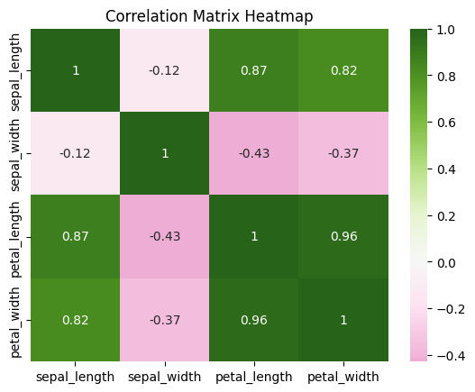
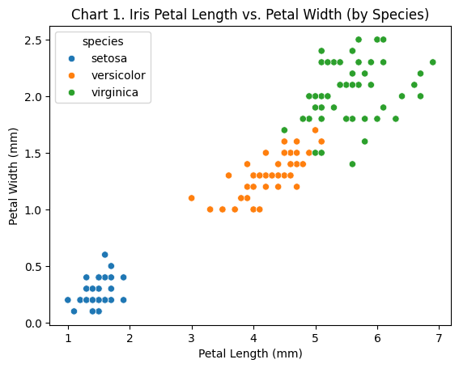
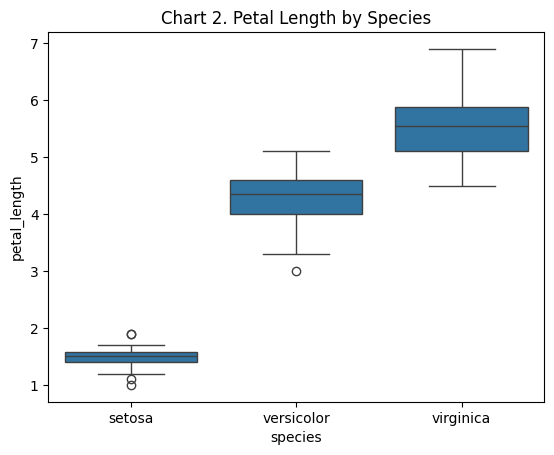
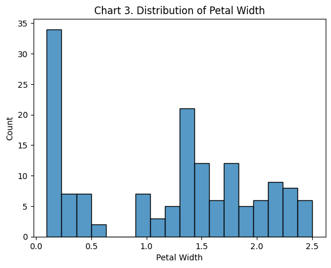

# Data Analytics Fundamentals

This site provides documentation for this project.
Use the navigation to explore module-specific materials.

## How-To Guide

Many instructions are common to all our projects.

See
[⭐ **Workflow: Apply Example**](https://denisecase.github.io/pro-analytics-02/workflow-b-apply-example-project/)
to get these projects running on your machine.

## Project Documentation Pages (docs/)

- **Home** - this documentation landing page
- [**Project Instructions**](./project-instructions.md) - specific to this module
- [**Your Files**](./your-files.md) - how to copy the example and create your version
- [**Glossary**](./glossary.md) - project terms and concepts
- [**API**](./api.md) - autogenerated code documentation for public project interface
   Not easy to read, but useful once you get used to it.
- **Module-specific**
  - [RESOURCES.md](./module/RESOURCES.md)
  - [seaborn-datasets.md](./module/seaborn-datasets.md)
  - [TROUBLESHOOTING.md](./module/TROUBLESHOOTING.md)

## Custom Project

### Dataset

The dataset used is the Seaborn Iris dataset.

This dataset contains information regarding different Iris flowers.

The features are:
- sepal_length
- sepal_width
- petal_length
- petal_width
- species

This dataset contains 150 clean rows of data.

### Signals

No new signals were created from this dataset.

Every feature from the original dataset was used, but there
was a focus on species and the relationship between
petal_length and petal_width.

Species was the only categorical feature, as the rest are
all numeric.

### Experiments

The first five sections of the custom project deal with cleaning and
prepping the data.

After that, stats are looked at for a more detailed look.

A correlation matrix between the numeric fields was made as well as
three more plots.

A scatter plot to show Petal Length vs Petal Width, a box plot to show the
stats and distribution of Petal Length by species, and a histogram to show
the distribution of Petal Width across all plants.

### Results

In the correlation matrix, very strong correlations were found.

The strongest correlation happens between petal_length and petal_width.

This correlation was then plotted on a scatter plot, showing not only the
strong correlation but also the different species.

Then the stats of petal_length by species was created using a box plot.

Again, the clear difference in species is showcased here.

Lastly, a histogram to show petal width for all plants was created.

Here it can again be seen that there are likely three groups of petal widths.

This most likely ties into each species having its own ranges.

### Interpretation

It has been found that each species of iris flowers tends to have its own ranges of features.
They can generally be told apart.

There were also very strong positive correlations found between numerous features.

With both of these facts, it would make sense to create a machine learning model to
correctly guess species.

There may also be features that could be created by feature engineering that can give more insights.
Some examples of possibly useful features would be:
- length-to-width ratios
- petal and sepal areas
- flower_size
